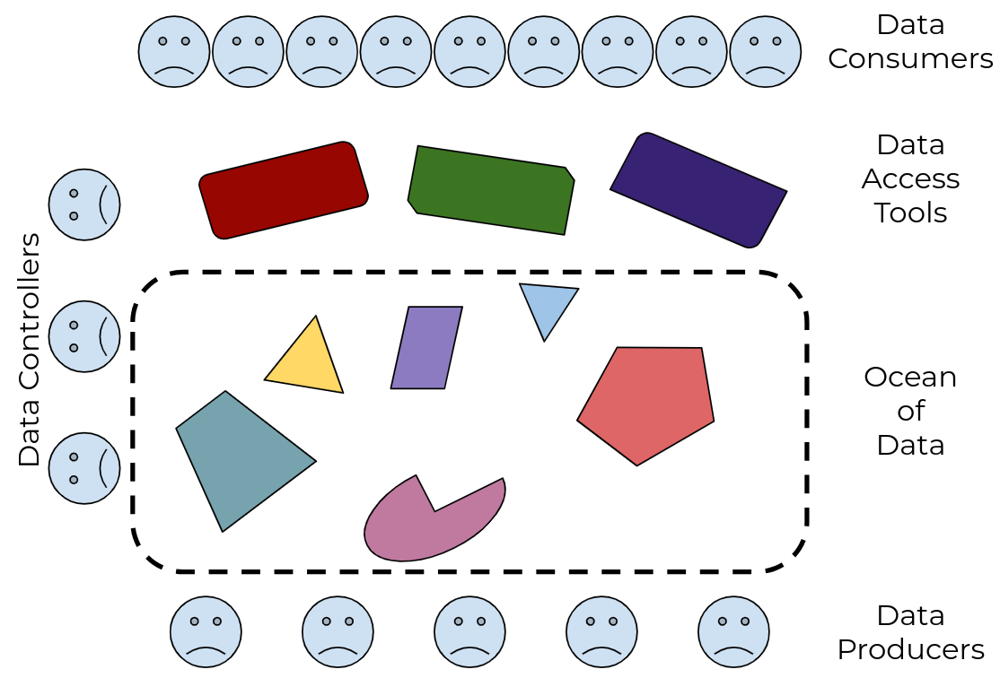
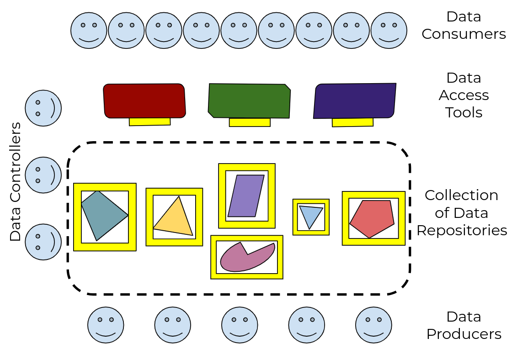
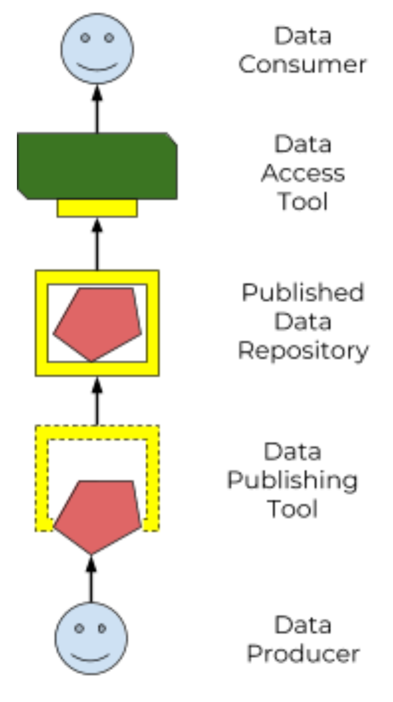

Data sharing requires portable data, consistent with the FAIR data principles (findable, accessible, interoperable, reusable). Today’s researchers and clinicians are surrounded by potentially useful data, but often need bespoke tools and processes to work with each dataset. Today’s data publishers don’t have a reliable way to make their data useful to all (and only) the people they choose. And today’s data controllers are tasked with implementing standard controls of non-standard mechanisms for data access.

*Figure 1: there’s an ocean of data, with many different tools to drink from it, but no guarantee that any tool will work with any subset of the data*

We need a standard way for data producers to make their data available to data consumers, that supports the control needs of the former and the access needs of the latter. And we need it to be interoperable, so anyone who builds access tools and systems can be confident they’ll work with all the data out there, and anyone who publishes data can be confident it will work with all the tools out there.

*Figure 2: by defining a standard Data Repository API, and adapting tools to use it, every data publisher can now make their data useful to every data consumer*

We envision a world where:

* there are many many **data consumers**, working in research and in care, who can use the tools of their choice to access any and all data that they have permission to see

there are many **data access tools** and platforms, supporting discovery, visualization, analysis, and collaboration

there are many **data repositories**, each with their own policies and characteristics, which can be accessed by a variety of tools

there are many **data publishing tools** and platforms, supporting a variety of data lifecycles and formats

there are many many **data producers**, generating data of all types, who can use the tools of their choice to make their data as widely available as is appropriate

*Figure 3: a standard Data Repository API enables an ecosystem of data producers and consumers*

## Federation

The world’s biomedical data is controlled by groups with very different policies and restrictions on where their data lives and how it can be accessed. A primary purpose of DRS is to support unified access to disparate and distributed data. (As opposed to the alternative centralized model of "let’s just bring all the data into one single data repository”, which would be technically easier but is no more realistic than “let’s just bring all the websites into one single web host”.)

In a DRS-enabled world, tool builders don’t have to worry about where the data their tools operate on lives — they can count on DRS to give them access. And tool users only need to know which DRS server is managing the data they need, and whether they have permission to access it; they don’t have to worry about how to physically get access to, or (worse) make a copy of the data. For example, if I have appropriate permissions, I can run a pooled analysis where I run a single tool across data managed by different DRS servers, potentially in different locations.
